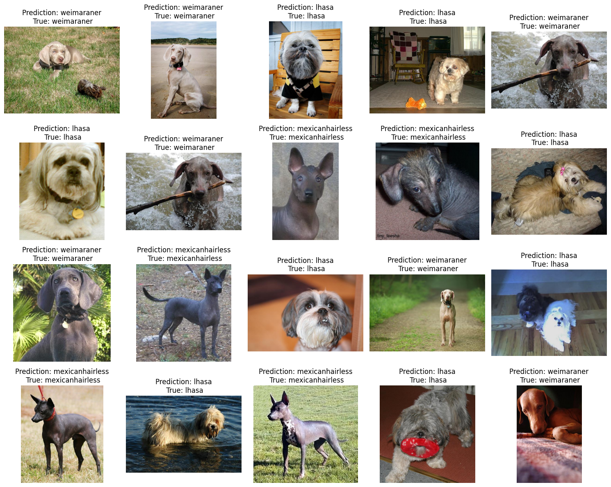
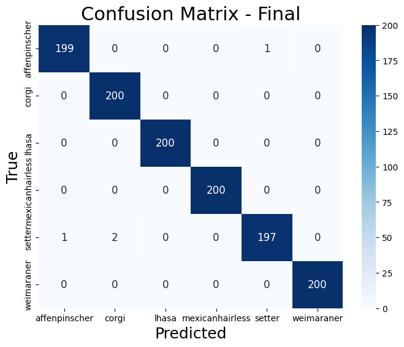
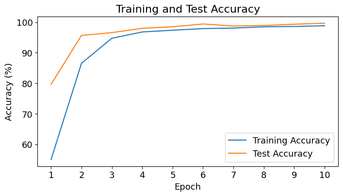
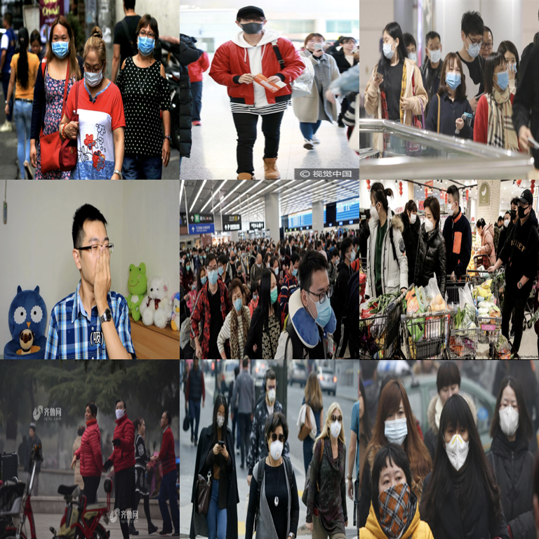
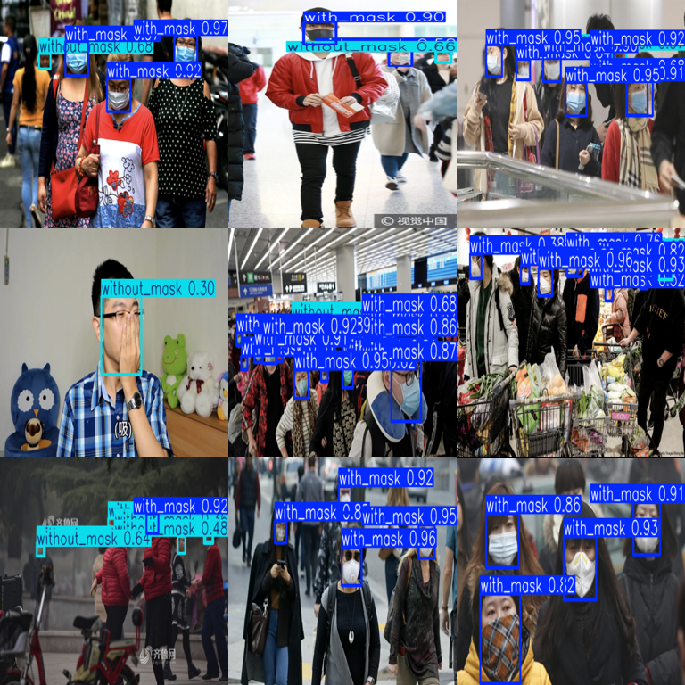

# Hernán Escobar-Sánchez

## Data Scientist

#### Technical Skills: Python, Pytorch, Statistical Analysis.

## Education

- M.S., Physics | Universidad de Concepción, Concepción, Chile (_September 2023_)
- B.S., Physics | Universidad de Concepción, Concepción, Chile (_December 2020_)

## Work Experience

**Data Scientist - AI Code Reviewer @ Revelo-Scale** (_July 2024 - Present_)
- Assessing the quality of AI-generated code.
- Resolving coding problems by crafting functional and efficient code solutions.
- Developing test cases to validate the efficiency and effectiveness of the code.

**Applied Scientist and Data Analyst @ Universidad San Sebastián** (_April 2023 - June 2024_)
- Conducted experimental setup, data collection, processing, and analysis for the characterization, simulation, and modeling of nano-materials.
- Developed physics-informed neural networks to estimate optical parameters for light absorption in nanomaterials.
- Contributed to and published a paper in an international scientific journal.

## Projects

---

<!-- HTML for Carousels -->

<html lang="en">
<head>
    <meta charset="UTF-8">
    <meta name="viewport" content="width=device-width, initial-scale=1.0">
    <title>Hernán Escobar-Sánchez</title>
    
</head>
<body>

<!-- First Carousel -->

    

        
    

    

        
    

    

        
    

    

        
    

    <a class="prev" onclick="plusSlides(-1, 'carousel1')">&#10094;</a>
    <a class="next" onclick="plusSlides(1, 'carousel1')">&#10095;</a>

 

     
     
     
     

<!-- Description for First Carousel -->

    
Dogs Breeds Classification: The model's accuracy improves significantly over 10 epochs, reaching 98.84% in training and 99.67% in testing. The loss decreases from 1.1626 to 0.03894 and from 0.6186 to 0.0206, respectively.  
    [GitHub Repository](https://github.com/Hernan3scobar/CNN_images_classification/tree/main)

<!-- Second Carousel -->

    

        
    

    

        
    

    <a class="prev" onclick="plusSlides(-1, 'carousel2')">&#10094;</a>
    <a class="next" onclick="plusSlides(1, 'carousel2')">&#10095;</a>

 

     
     

<!-- Description for Second Carousel -->

    
Utilized YOLO (You Only Look Once) for accurate mask-wearing classification in images. The deployment of this model is straightforward, making it user-friendly and effective for staff. YOLO’s efficiency in processing ensures reliable results for mask detection with minimal setup.

</body>
</html>

## Publications

- Escobar-Sánchez, H.; Carril Pardo, C.; Benito, N.; Hernández-Montelongo, J.; Nancucheo, I.; Recio-Sánchez, G. Plasmonic and Photothermal Effects of CuS Nanoparticles Biosynthesized from Acid Mine Drainage with Potential Drug Delivery Applications. *Int. J. Mol. Sci.* 2023, 24, 16489. [https://doi.org/10.3390/ijms242216489](https://doi.org/10.3390/ijms242216489)

For inquiries, feel free to email me at: [hernanescobarsanchez@gmail.com](mailto:hernanescobarsanchez@gmail.com).
