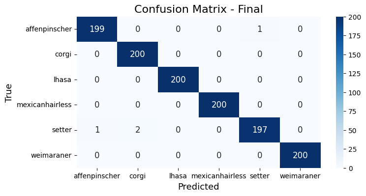
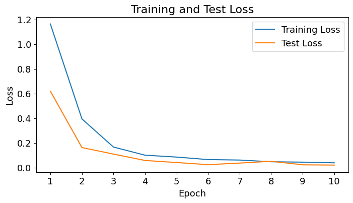

# Data Scientist

#### Technical Skills: Python, Pytorch, Stadistical Analysis.

### Education

- M.S., Physics	| Universidad de Concepción, Concepción, Chile (_September 2023_)	 			        		
- B.S., Physics | Universidad de Concepción, Concepción, Chile (_December 2020_)
  
### Work Experience
**Data Scientist - AI code reviwer @ Revelo-Scale (_July 2024 - Present_)**
- Assessing the quality of AI-generated code. 
- Resolving coding problems by crafting functional and efficient code solutions.
- Developing test cases to validate the efficiency and effectiveness of the code.
  
**Applied Scientist and Data Analyst @ Universidad San Sebastián  (_April 2023 - June 2024_)**
- Conducted experimental setup, data collection, processing, and analysis for the characterization, simulation, and modeling of nano-materials.
- Developed Physics-informed neural networks to estimate optical parameters for light absorption in nanomaterials.
- Contributed to and published a paper in an international scientific journal.

### Projects
Dogs breeds classification
- The model's accuracy improves significantly over 10 epochs, reaching 98.84% in training and 99.67% in testing, with corresponding decreases in loss from 1.1626 to 0.03894 and 0.6186 to 0.0206, respectively.
[GitHub repository](https://github.com/Hernan3scobar/CNN_images_classification/tree/main)

<html lang="en">
<head>
    <meta charset="UTF-8">
    <meta name="viewport" content="width=device-width, initial-scale=1.0">
    <title>Hernán Escobar-Sánchez</title>
    
</head>
<body>

    

        
    

    

        
    

    

        
    

    

        
    

    

        
    

    <a class="prev" onclick="plusSlides(-1)">&#10094;</a>
    <a class="next" onclick="plusSlides(1)">&#10095;</a>

 

     
     
     

</body>
</html>

## Publications
.- Escobar-Sánchez, H.; Carril Pardo, C.; Benito, N.; Hernández-Montelongo, J.; Nancucheo, I.; Recio-Sánchez, G. Plasmonic and Photothermal Effects of CuS Nanoparticles Biosynthesized from Acid Mine Drainage with Potential Drug Delivery Applications. Int. J. Mol. Sci. 2023, 24, 16489. [https://doi.org/10.3390/ijms242216489]

Para contactarme, puedes enviarme un correo a [miemail@example.com](mailto:miemail@example.com).
